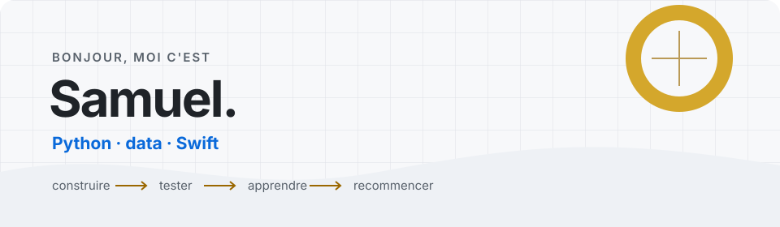

<!--
THESIS: A GitHub profile should show honest progress, not imitate a senior developer's dashboard.
OWN-WORLD: A quiet notebook-like canvas, cobalt and amber accents, precise lines, and one compact visual header.
STORY: Samuel builds practical prototypes, explains what they do, and improves them step by step.
FIRST VIEWPORT: A restrained banner names Samuel, his current technologies, and his build-test-learn rhythm.
FORM: A short personal note followed by two real projects, current learning, and a small technology list.
-->

<picture>
  <source media="(prefers-color-scheme: dark)" srcset="./assets/header-dark.svg">
  <source media="(prefers-color-scheme: light)" srcset="./assets/header-light.svg">
  
</picture>

Je transforme des idées en **prototypes concrets** pour apprendre comment les choses fonctionnent vraiment.
Ce GitHub est mon carnet de progression : les projets ne sont pas tous parfaits, mais chacun m'a appris quelque chose.

### Ce que je construis

**[Webtoon Lens](https://github.com/samsam-zrh/webtoon-lens-ios)** 
Un lecteur web local pour importer des pages de webtoon en anglais ou chinois et les traduire en français. OCR avec Vision sur Mac, modèle local et glossaire par série : le texte est ajusté dans les bulles, avec l'original toujours accessible. Le dépôt contient aussi le prototype iOS en SwiftUI.

**[Dashboard RES2-6-9](https://github.com/samsam-zrh/enedis-res2-6-9-ai-dashboard)**  
Un projet data autour de fichiers Enedis : préparation des données, détection de cas RS/RP, prévisions simples et visualisation dans une interface Streamlit.

### Mes petits projets

**[Budget CLI](https://github.com/samsam-zrh/budget-cli)**  
Un gestionnaire de dépenses en Python qui enregistre les données dans un fichier CSV. Le projet reste court, utilise uniquement la bibliothèque standard et contient quelques tests unitaires.

**[Focus Timer](https://github.com/samsam-zrh/focus-timer)** · **[Essayer en ligne](https://samsam-zrh.github.io/focus-timer/)**  
Un minuteur Pomodoro sans framework, réalisé en HTML, CSS et JavaScript. Le compteur des sessions terminées est sauvegardé directement dans le navigateur.

### En ce moment

- je simplifie mes projets pour qu'ils soient plus faciles à lancer et à comprendre ;
- j'améliore ma façon de structurer et documenter mon code ;
- je continue à pratiquer **Python**, **JavaScript**, la **data visualisation** et **Swift**.

### Outils que j'utilise

`Python` · `pandas` · `Streamlit` · `JavaScript` · `HTML/CSS` · `Swift` · `SwiftUI` · `Git`

---

Je préfère un petit projet terminé et expliqué à un gros projet impossible à relire.
